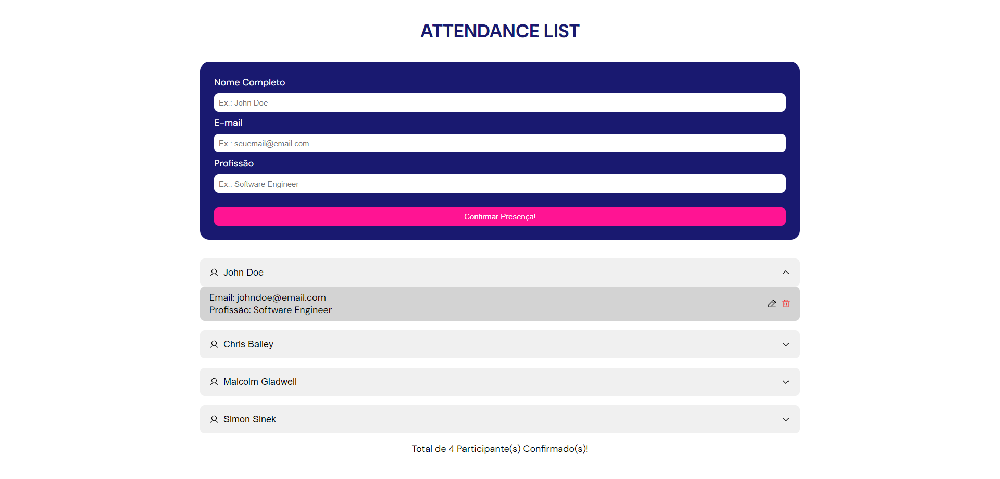

# Attendance List

  

## 📑 Description

This project consists of an attendance list model that can be used for professional purposes, where users fill out a form with their name, email and profession to confirm their presence, which can generate a possible lead.

## 🔗 Functions

The Attendance List project was created to practice some React methods along with the use of TypeScript and CSS Modules. Furthermore, the responsive interface uses Radix UI components (Accordion and Dialog) and icons from the Phosphor Icons library.

In this project, it is possible for the user to confirm their presence by entering their data in the form, which generates a new registration in the attendance list, in addition, it allows the user to edit the data of an existing registration or remove it.

Finally, the data added to the project is stored in the browser's local storage.

## 💻 Language and Tools

For the development of this project, the following languages and tools were used:

- [CSS Modules](https://developer.mozilla.org/pt-BR/docs/Web/CSS)
- [Phosphor Icons](https://phosphoricons.com/)
- [Radix UI](https://www.radix-ui.com/)
- [React](https://react.dev/)
- [TypeScript](https://www.typescriptlang.org/)
- [uuid](https://www.npmjs.com/package/uuid)
- [Vite](https://vitejs.dev/)

## 🚀 Deploy

Click on the link below to access the project 👇🏾

- [Attendance List](https://attendance-list-pro.vercel.app/)
